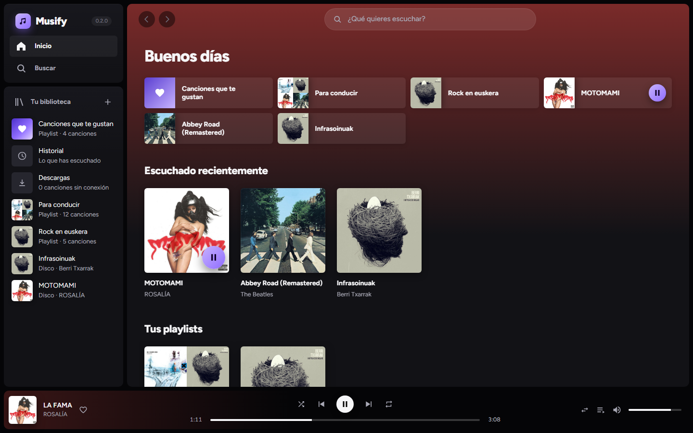
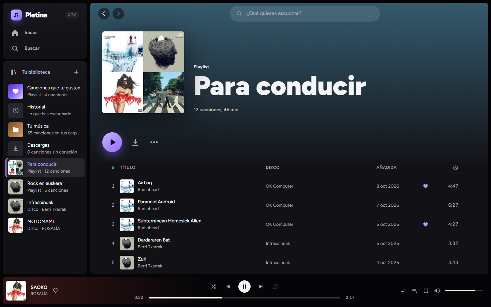
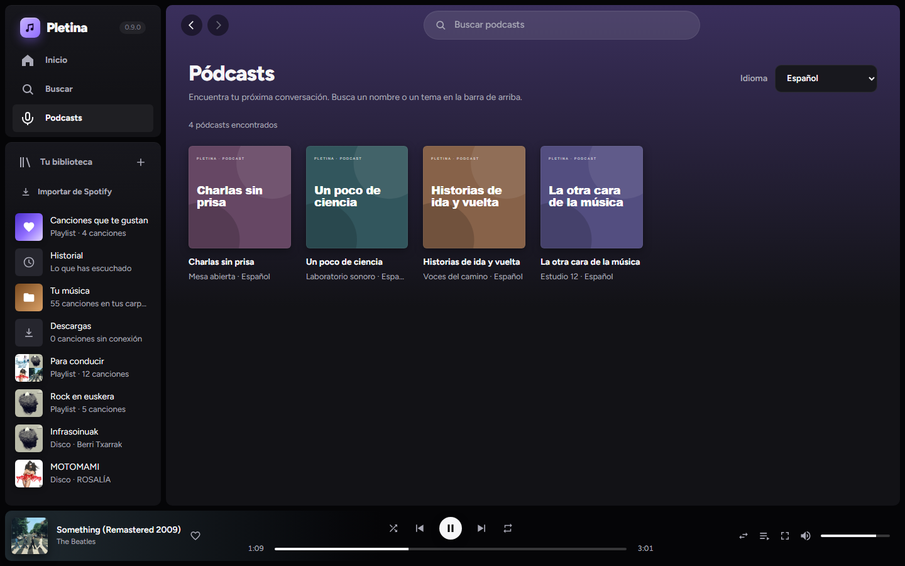
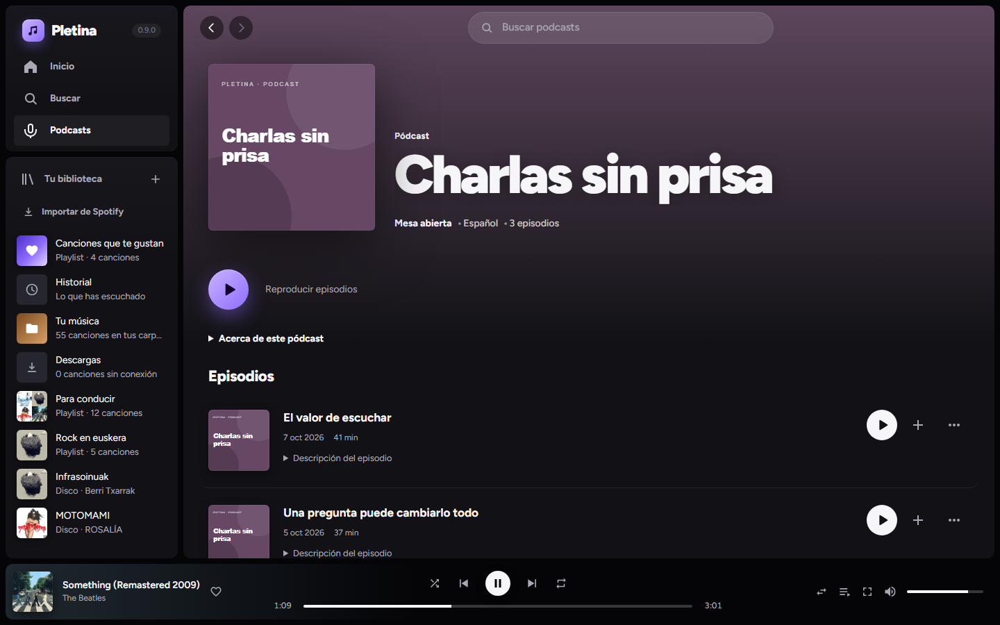
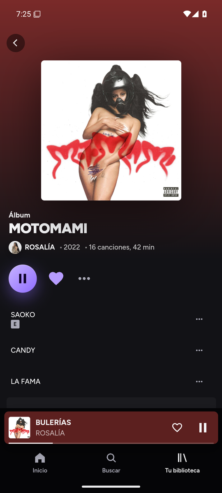
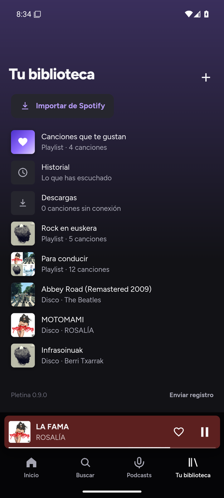
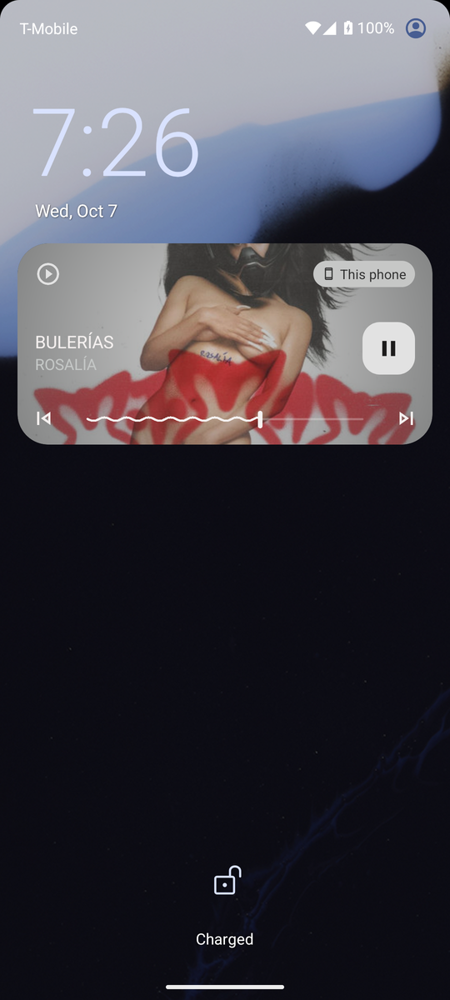
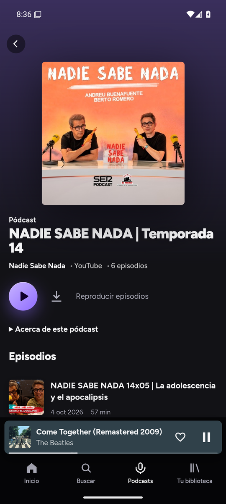

# Pletina

Reproductor de música tipo Spotify para Windows, Mac, Linux y Android. Busca grupos y discos en Deezer (carátulas y listas de canciones), encuentra cada canción en YouTube Music y la reproduce en streaming de solo audio, sin anuncios. Biblioteca, playlists, historial, cola tipo DJ, descargas para escuchar sin conexión (también en el móvil) y actualizaciones automáticas; en el PC, además, tu propia música.

Software libre con licencia [GPL-3.0](LICENSE). Antes se llamaba Musify.



| | |
|---|---|
|  |  |
| **Disco:** la portada tiñe toda la pantalla | **Artista:** foto de cabecera y sus canciones más escuchadas |
|  |  |
| **Sonando ahora:** pantalla completa con la cola | **Playlist:** se ordena arrastrando |
|  |  |
| **Podcasts:** también los de YouTube Music (en la captura, programas de ejemplo) | **Un programa:** sus episodios comparten cola, favoritos e historial con la música |

### En el móvil

La misma app, pensada para el dedo. La música suena en un servicio de Android: sigue con la pantalla apagada y se maneja desde la pantalla de bloqueo, la notificación y los auriculares. Los discos y playlists se descargan para escucharlos sin conexión, y siguen bajando aunque salgas de la app.

<table>
  <tr>
    <td width="33%"></td>
    <td width="33%"></td>
    <td width="33%"></td>
  </tr>
  <tr>
    <td><b>Inicio</b>, con lo que suena abajo</td>
    <td><b>Sonando ahora</b>: se cierra deslizando hacia abajo</td>
    <td><b>Cola</b>: tu cola se ordena arrastrando el asa</td>
  </tr>
  <tr>
    <td width="33%"></td>
    <td width="33%"></td>
    <td width="33%"></td>
  </tr>
  <tr>
    <td><b>Disco</b></td>
    <td><b>Tu biblioteca</b>: playlists, discos, importar de Spotify y la versión</td>
    <td><b>Pantalla de bloqueo</b>: sigue sonando con la pantalla apagada</td>
  </tr>
  <tr>
    <td width="33%"></td>
    <td></td>
    <td></td>
  </tr>
  <tr>
    <td><b>Podcasts</b>: también los de YouTube, que se pueden descargar</td>
    <td></td>
    <td></td>
  </tr>
</table>

### Android Auto (en desarrollo)

El servicio multimedia ofrece **Favoritos**, **Playlists**, **Descargas** y **YouTube** a Android Auto. Al elegir una canción, continúa con el resto de su lista; los mandos del coche permiten pausar, reanudar y cambiar de canción. Puede arrancar sin abrir antes la pantalla de Pletina. La búsqueda consulta las canciones guardadas en tu biblioteca.

Esta integración todavía no está publicada ni validada en un coche. Para probar un APK instalado fuera de Google Play, activa **Orígenes desconocidos** en las opciones de desarrollador de Android Auto. Consulta las [instrucciones y pruebas de Android Auto](docs/android-auto.md).

### Artistas favoritos

En la página de un artista, pulsa **Añadir a favoritos**. Aparecerá en **Tu biblioteca → Artistas favoritos**, tanto en el ordenador como en el móvil. Puedes quitarlo desde su página o con el corazón de la biblioteca. Los favoritos se guardan en el dispositivo y se conservan al cerrar la app.

### Canciones de YouTube

En **Tu biblioteca → Canciones de YouTube**, pega el enlace de un vídeo de YouTube o YouTube Music y pulsa **Continuar**. Revisa el título y el artista o canal, corrígelos si hace falta y pulsa **Guardar canción**. También se admiten enlaces compartidos de `youtu.be` y enlaces de Shorts. No hace falta que la canción esté en el catálogo de Deezer.

Las canciones guardadas se pueden reproducir, añadir a la cola, favoritos y playlists, y descargar para escucharlas sin conexión, también en Android. Guardar otra vez el mismo vídeo actualiza sus datos sin duplicarlo. **Quitar de Canciones de YouTube**, en el menú ⋯, lo oculta de esa sección: conserva sus apariciones en playlists, favoritos, historial y descargas. Pegar de nuevo su enlace vuelve a mostrarlo.

Para añadir un vídeo nuevo hace falta conexión y que esté disponible públicamente; si requiere una cuenta o ya no está disponible, la app muestra el error y no lo sustituye por otro vídeo.

### Importar playlists de Spotify

En **Tu biblioteca → Importar de Spotify**, pega el enlace completo de una lista pública. Pletina lee sus títulos y artistas, busca las canciones equivalentes en su catálogo y muestra las encontradas y las omitidas. Revisa el resultado, cambia el nombre si quieres y pulsa **Guardar playlist**: se crea una lista nueva, conservando el orden y las repeticiones. Puedes cancelar o reintentar una búsqueda interrumpida sin crear una lista a medias.

La vista pública de Spotify puede devolver solo parte de una lista (habitualmente hasta las primeras 100 canciones) y no permite consultar listas privadas. Para esas listas, importa un **CSV que ya hayas exportado**, de hasta 10 MB y 10.000 filas. Se admiten columnas `Track Name` y `Artist Name(s)` (o `Title` y `Artist`), y opcionalmente `Duration (ms)` e `ISRC`; los artistas múltiples se separan con punto y coma. Se leen archivos separados por comas, punto y coma o tabuladores. Los episodios, archivos locales y filas sin título o artista se omiten con aviso.

No hace falta iniciar sesión en Spotify. La importación copia las canciones encontradas al catálogo local de Pletina; no sincroniza cambios posteriores. Las listas originales de Spotify no se modifican. La disponibilidad depende de la vista pública de Spotify y de las coincidencias del catálogo.

### Podcasts

La sección **Podcasts**, en la barra lateral y en la navegación del móvil, permite buscar programas y escuchar sus episodios. El filtro **Idioma** empieza en español y recuerda tu elección; incluye inglés, catalán, euskera, gallego, francés, portugués, alemán, italiano y todos los idiomas. Se comprueba el idioma que publica cada programa en su RSS: las variantes regionales se agrupan y los programas sin idioma declarado solo aparecen al elegir todos.

En la ficha de cada programa puedes **añadirlo a favoritos**, tanto si procede de RSS como de YouTube. Queda anclado en **Tus pódcasts**, al principio de la sección, y se conserva al reiniciar. Tus programas siguen visibles al cambiar de búsqueda o idioma y aunque falle el catálogo. Puedes quitarlos desde su ficha o desde esa sección; los episodios que hayas marcado como favoritos, añadido a playlists o descargado se conservan.

Los episodios se reproducen desde el audio publicado por su autor y comparten la cola, favoritos, playlists e historial con la música. El catálogo procede de Apple Podcasts y la disponibilidad depende de las fuentes de cada programa; estos episodios necesitan conexión.

Debajo salen también los programas de **YouTube Music**, en su propia sección («En YouTube»), con su portada; allí cada temporada suele ser un programa aparte. Sus episodios suenan con el mismo motor que la música (también en el móvil con la pantalla apagada) y se pueden **descargar** para escucharlos sin conexión, igual que una canción. YouTube no dice el idioma de cada programa, así que esa sección no se filtra.

## Instalar

Descarga el archivo de tu sistema desde la [última versión](https://github.com/diad87/pletina-releases/releases/latest):

| Sistema | Archivo |
|---|---|
| Windows 10/11 | `Pletina_x.y.z_x64-setup.exe`: doble clic |
| Mac (chip de Apple o Intel, macOS 11+) | `Pletina_x.y.z_universal.dmg`: arrastrar a Aplicaciones |
| Linux (64 bits) | `Pletina_x.y.z_amd64.AppImage` (distribuciones recientes) o `.deb` (Ubuntu/Debian) |
| Android 7 o superior (64 bits) | `Pletina_x.y.z_android.apk`, mejor con Obtainium (abajo) para que se actualice sola |

Mientras el instalador de Windows no esté firmado (ver [Code signing policy](#code-signing-policy)), Windows avisa la primera vez: «Más información» → «Ejecutar de todas formas». El de Mac no está firmado por Apple: la primera vez, clic derecho en la app → Abrir. Las actualizaciones no avisan, porque las baja la propia app.

Si tenías Musify, Pletina la sustituye al instalarse (o al actualizarse sola) y conserva tu biblioteca.

En Linux, la AppImage incluye el soporte multimedia y el motor JavaScript necesario para YouTube. Dale permiso de ejecución antes de abrirla (`chmod +x Pletina_*.AppImage`). Para el `.deb`, usa `sudo apt install ./Pletina_*.deb` para instalar también sus dependencias de audio. La compilación de distribución usa Ubuntu 22.04 como base; las distribuciones más antiguas pueden necesitar una versión más nueva del sistema.

### Android, con Obtainium

No está en Google Play. [Obtainium](https://github.com/ImranR98/Obtainium) instala el APK desde aquí y lo actualiza cuando sale una versión nueva:

1. Instala Obtainium (desde su GitHub o desde F-Droid).
2. En Obtainium, «Añadir app», pega `https://github.com/diad87/pletina-releases` y pulsa «Añadir». Se queda con el `.apk` de la última versión (la de los extractores no cuenta: es una versión previa).
3. Pulsa «Instalar». La primera vez, Android pide permiso para instalar apps desde Obtainium.

Para escuchar sin conexión: ⬇ en un disco o una playlist, o «Descargar» en el menú ⋯ de una canción. Lo descargado está en Tu biblioteca → Descargas, y sin conexión suena también desde su disco o su playlist (lo que no está descargado se salta). Todavía no se puede escuchar la música guardada en el teléfono (fase 4 del plan).

### Se actualiza sola

En el PC, la app busca versiones nuevas al arrancar y cada pocas horas, las descarga en segundo plano y las instala al cerrarse (en Linux, con el AppImage). En Android, Obtainium avisa de cada versión y la instala encima sin perder la biblioteca. Todas las actualizaciones van firmadas: la app de escritorio no instala nada que no lleve nuestra firma, y Android no deja instalar encima un APK firmado por otro.

### Comprobar que una descarga es auténtica

Desde la 0.8.0, cada archivo de una versión lleva un certificado de procedencia de GitHub: demuestra que sale de este código y de su compilación en GitHub Actions, sin pasar por el ordenador de nadie. Con la [CLI de GitHub](https://cli.github.com):

```bash
gh attestation verify Pletina_0.8.0_x64-setup.exe --repo diad87/pletina
```

Cada versión trae además `SHA256SUMS.txt` con la huella de cada archivo: `sha256sum -c SHA256SUMS.txt` en Linux o Mac, o en Windows `Get-FileHash Pletina_0.8.0_x64-setup.exe` y compararla con la de la lista.

## Privacidad

Pletina no tiene cuentas, ni analíticas, ni servidores propios. Tu biblioteca, tus playlists y tu historial se guardan solo en tu equipo. Se conecta a:

- **Deezer**, para buscar artistas y discos y bajar las carátulas ([privacidad de Deezer](https://www.deezer.com/legal/personal-datas)).
- **Spotify**, solo al importar una playlist mediante su enlace público, para leer los títulos y artistas. Al importar por enlace o CSV, se consultan esos títulos, artistas y, si existe, el ISRC en **Deezer** para encontrar las canciones equivalentes. No se envía el archivo CSV a Spotify ni se solicitan credenciales de su cuenta.
- **Apple Podcasts**, para buscar podcasts, y **los servidores de sus autores y proveedores de alojamiento**, para consultar el idioma y los episodios del RSS, cargar las portadas y reproducir el audio. Estas conexiones se realizan al usar la sección de podcasts.
- **YouTube y YouTube Music**, para encontrar cada canción, buscar sus podcasts y reproducir el audio ([privacidad de Google](https://policies.google.com/privacy)).
- **GitHub**, para buscar y bajar actualizaciones de la app y de los extractores de audio, y yt-dlp en el PC ([privacidad de GitHub](https://docs.github.com/site-policy/privacy-policies/github-general-privacy-statement)).

El registro de errores no sale del equipo salvo que tú lo compartas con «Enviar registro».

## Code signing policy

Free code signing provided by [SignPath.io](https://about.signpath.io), certificate by [SignPath Foundation](https://signpath.org).

La firma gratuita para proyectos de código abierto está solicitada a SignPath Foundation; hasta que la aprueben, los instaladores de Windows van sin firmar. Los instaladores se compilan en GitHub Actions a partir de este repositorio y solo se firman los que salen de ahí. Cada firma la aprueba a mano una persona del equipo.

- Committers and reviewers: [diad87](https://github.com/diad87)
- Approvers: [diad87](https://github.com/diad87)

Privacy: see [Privacidad](#privacidad). Pletina connects to Deezer, YouTube, GitHub, Spotify when importing public playlists, Apple Podcasts and podcast publishers as described there. It has no accounts or telemetry.

## Cómo funciona

- **Tauri 2** (Rust) + **Svelte 5** + TypeScript. Instalador de unos 3 MB en Windows; el APK de Android, 12 MB.
- Datos en local (SQLite en la carpeta de datos de la app). El PC y el móvil tienen cada uno los suyos: todavía no se sincronizan.
- El audio de YouTube sale de yt-dlp, de youtubei.js o de un motor propio (se elige pulsando el número de versión, arriba a la izquierda; en el móvil, siempre el propio). Cada extractor se actualiza solo desde su fuente, sin reinstalar la app: yt-dlp desde su GitHub, youtubei.js desde npm y el motor propio desde este repositorio.
- En Android, la música la reproduce un servicio nativo (Media3/ExoPlayer) que pide el audio directamente al núcleo de Rust; la interfaz es el mando. Las descargas usan el motor propio (allí no hay yt-dlp).
- Por dentro, algunas cosas conservan el nombre antiguo (el identificador `dev.musify.desktop`, el paquete de Android, la base de datos `musify.db`) para que las instalaciones de Musify sigan actualizándose y no pierdan la biblioteca.

El plan, el estado de cada fase y las decisiones están en [PLAN.md](PLAN.md); lo del móvil, en [docs/plan-mobile.md](docs/plan-mobile.md).

## Desarrollo

Requisitos: Node 24 y Rust. En Windows, toolchain MSVC, Visual Studio Build Tools (C++) y WebView2.

```bash
npm install
npm run tauri dev      # app en modo desarrollo
npm run build:local    # instalador sin firmar en src-tauri/target/release/bundle/
npm run dev            # solo la interfaz en el navegador, con datos de ejemplo (src/dev)
npm run check          # tipos
cd src-tauri && cargo test   # tests (con red: cargo test -- --ignored --nocapture)
```

**Linux:** instala las dependencias de Tauri y audio: `libwebkit2gtk-4.1-dev libappindicator3-dev librsvg2-dev patchelf libssl-dev gstreamer1.0-plugins-base gstreamer1.0-plugins-good gstreamer1.0-libav`. Usa la distribución oficial de Node 24 conservando su archivo `LICENSE`: al compilar, `scripts/prepare-linux-runtime.mjs` incorpora ese ejecutable y su licencia en los paquetes. `npm run tauri build -- --config src-tauri/tauri.local.conf.json --bundles appimage,deb` genera los paquetes sin firmar. Antes de ejecutar `cargo test` directamente, prepara los recursos con `node scripts/prepare-linux-runtime.mjs`.

La prueba `bash scripts/test-linux-appimage.sh ruta/al/paquete.AppImage` necesita `ffmpeg` y `gstreamer1.0-tools`. Comprueba el Node incluido y decodifica WAV, MP3, FLAC, Ogg, M4A, Opus y WebM con las bibliotecas y plugins del paquete, sin usar los plugins del sistema. GitHub Actions ejecuta esta prueba antes de publicar los instaladores de Linux.

La regresión del reproductor real se ejecuta con `python3 scripts/tests/linux-playback.py ruta/al/paquete.AppImage --output-dir target/linux-playback-test`. Requiere también `xvfb webkit2gtk-driver pulseaudio` y `cargo install tauri-driver --version 2.1.0 --locked`. Extrae el paquete, crea datos y biblioteca temporales, y prueba desde la interfaz seis formatos locales y una descarga WebM de prueba, con avance, pausa y reanudación. Usa una pantalla y una salida de audio virtuales privadas, sin Node en el `PATH` ni servicios externos de música. Guarda el resultado JSON, los registros y una captura en el directorio indicado. Esta prueba detecta fallos del transporte de archivos en WebKit que la comprobación de códecs por sí sola no puede detectar.

**Android:** además, el SDK de Android con el NDK 27.3.13750724, Java 21 y el objetivo de Rust `aarch64-linux-android` (y `x86_64-linux-android` para el emulador). `npm run tauri android build -- --apk --target aarch64` compila el APK; sale firmado si está la clave en `%USERPROFILE%\.musify\android.jks`. En Windows, Tauri no puede crear el enlace a la librería de Rust: se copia `src-tauri/target/<objetivo>/release/libmusify_lib.so` a `src-tauri/gen/android/app/src/main/jniLibs/<abi>/` y se termina con Gradle (`gradlew.bat assembleUniversalRelease -x rustBuildUniversalRelease`). Detalles y pruebas en [docs/plan-mobile.md](docs/plan-mobile.md).

Las capturas de escritorio se sacan de la vista previa del navegador (`npm run dev`), por ejemplo `http://localhost:1420/?view=album&id=14879699&play=1&playId=14879699` (ver `src/dev/preview.ts`), a 1440×900. Las del móvil, del emulador de Android con la app de verdad.

## Publicar una versión

1. Subir la versión en `package.json` y `src-tauri/Cargo.toml`.
2. Commit y etiqueta anotada: `git tag -a vX.Y.Z` (el mensaje de la etiqueta son las notas de la versión) y `git push --follow-tags`.
3. GitHub Actions compila Windows, Mac, Linux y el APK de Android, los firma, genera `latest.json` y publica en [pletina-releases](https://github.com/diad87/pletina-releases), de donde las apps instaladas se actualizan solas (las de Android, con Obtainium).

Para publicar hace falta el secreto `RELEASES_TOKEN`. Sin él, Actions lo compila todo pero no lo publica; se publica a mano con los artefactos de esa ejecución:

```bash
gh run download <id> -R diad87/pletina -D artifacts
node scripts/release.mjs artifacts vX.Y.Z notas.md
gh release create vX.Y.Z artifacts/_release/* -R diad87/pletina-releases --title "Pletina X.Y.Z" --notes-file notas.md
```

## Publicar extractores

Los extractores (receta y script del motor propio, youtubei.js) se publican aparte, sin sacar versión de la app:

1. Al cambiar uno, subir su `version` en `src-tauri/extractors.json`.
2. Subirlo a `main`: GitHub Actions lo empaqueta, lo firma y lo publica en la versión `extractores` de pletina-releases. Las apps lo cambian solas en unas horas.

Cada día GitHub Actions mira también si hay youtubei.js nuevo y, si funciona, lo pone y lo publica. A mano: `node scripts/extractors.mjs` (o `--dry-run`, o `--to <carpeta>` para probar con `MUSIFY_EXTRACTORS_URL`).

## Claves de firma

Están en `%USERPROFILE%\.musify\` y en los secretos del repositorio: `updater.key` para escritorio y extractores (`TAURI_SIGNING_PRIVATE_KEY`) y `android.jks` para el APK (`ANDROID_KEYSTORE`), cada una con su contraseña. Sin ellas no se pueden publicar actualizaciones. Si se pierde la de Android, los móviles no aceptan la versión siguiente sin desinstalar (y perder la biblioteca): hay que guardar una copia de esa carpeta.

## Licencia

Pletina es software libre: puedes usarla, estudiarla, cambiarla y compartirla según la [GNU General Public License v3.0](LICENSE) o posterior. Si distribuyes una versión modificada, tiene que ir también con su código y la misma licencia.
